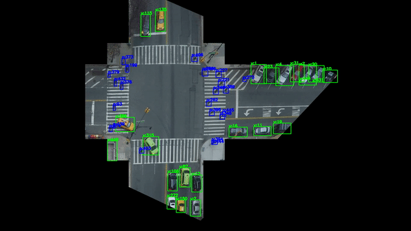

# Tracktor-final
**Mingfei Sun (ms5898)**

## Table of Contents

- [Dependencies](#Dependencies)
- [Dataset Prepare](#Dataset-Prepare)
- [Training the Faster R-CNN for Tracktor](#Training-the-Faster-R-CNN-for-Tracktor)
- [Get the tracking result on CVAT videos](#Get-the-tracking-result-on-CVAT-videos)
- [Do evaluation](#Do-evaluation)
- [Generate the result to see](#Generate-the-result-to-see)
- [References](#References)

## Dependencies
To install all dependency packages, run the command `$ pip install -r requirements.txt`. Use python 3.

## Dataset Prepare
#### You can just download from the google cloud:
* Just download [COSMOS_data_tracktor](url) from the shared google cloud, it has all the data you need for the experiment in Tracktor

#### If you can not download from the google cloud, you can also prepare it by yourself:

1. **Prepare a folder to put the dataset in called ``COSMOS_data_tracktor``, so your project folder should like that:**
```
ProjectTrafficIntersection.COSMOS.V2
|---Tracktor
|---COSMOS_data_tracktor
```

2. **Prepare the dataset for training the Faster R-CNN which use in the Tracktor to predict the next location of the target:**
* make a folder called ``detection_dataset`` in ``COSMOS_data_tracktor`` and download [maskrcnn_lablled-bbox-train-val.tar](https://drive.google.com/open?id=17FkzKVmcCypZNkO6PfKXbLUxji-Cj0_g) and [main-dataset-V4-DTL-20190908.tar](https://drive.google.com/open?id=1lPQr4pkyKYgJtpV99wRmHuXKqw-a9_3V) unzip them in ``COSMOS_data/COSMOS_data_tracktor``.
* After you download the two dataset above you will find that they are in different format, you should make them in the same format, so you should run that:
```
python dataset/data_prepare.py -- root (your main-dataset-V4-DTL-20190908 folder) 
                               --output_dir (your output folder for changed format)
```
Example: for me this step is 
```
python dataset/data_prepare.py -- root ../COSMOS_data_tracktor/detection_dataset/main-dataset-V4-DTL-20190908
                               --output_dir ../COSMOS_data_tracktor/detection_dataset/detection_dataset3
```
After that you will find there are three folder in your ``COSMOS_data_tracktor/detection_dataset`` the first two are downloaded from the internet and the last one is created by running the script ``dataset/data_prepare.py``

* You can use the jupyter notebook ``Notebook_experiment/PyTorch Dataset.ipynb`` to check the detection dataset result

3. **Dataset for Tracking:**

* Download the [CVAT](https://drive.google.com/open?id=1b40mIfUziefByIwRiWQk-H9PxhjfPBHy)** and put that in ``COSMOS_data_tracktor``

* change the original format to [MOT format](https://motchallenge.net) by runing the jupyter notebook ``Notebook_experiment/process tracking data and show.ipynb``

* After that you will find all videos are saved as MOT format in ``COSMOS_data_tracktor/Track_data_cosmos/v_and_p``, ``COSMOS_data_tracktor/Track_data_cosmos/only_v`` and ``COSMOS_data_tracktor/Track_data_cosmos/only_p`` you can delete the folder ``CVAT`` if you want.

* Yoy can use ``Notebook_experiment/sequence dataset for test.ipynb`` to check the tracking data format

4. **Mask R-CNN result:**

* Download [Mask R-CNN result](https://drive.google.com/drive/folders/1KRdJQcaO2EuUWOLF4AjZO0sXqMhP5vcb) and put it in ``COSMOS_data_tracktor``

* You can process the mask output result by running:
```
python dataset/data_prepare.py -- root (your MaskRCNN folder) 
                               --output_dir (your output folder for changed format)
```
Example: for me this step is 
```
python dataset/data_prepare.py -- root ../COSMOS_data_tracktor/MaskRCNN
                               --output_dir ../COSMOS_data_tracktor/mask_detect_result
```

* You can delete ``MaskRCNN`` if you want 

* You can check your mask R-CNN output by using ``Notebook_experiment/Process mask rcnn and show the result.ipynb``

5. **You can check the dataset for Tracking by using ``Notebook_experiment/sequence dataset for test.ipynb``**

6. **Download the trained model**

* You can download the trained model [frcnn_cosmos_output](url) and put it in the folder ``COSMOS_data_tracktor``
---

#### Now you finished dataset pareparing. You folder should like this:
```
ProjectTrafficIntersection.COSMOS.V2
|
|---Tracktor
|
|---COSMOS_data_tracktor
|    |
|    |---detection_dataset
|    |   |---maskrcnn_lablled-bbox-train-val
|    |   |---detection_dataset3
|    |
|    |---Track_data_cosmos
|    |   |---v_and_p
|    |   |---only_v
|    |   |---only_p
|    |
|    |---mask_detect_result
|    |   |---traffic_video_GOPR0589_190720_1324_1454_90sec_calibrated.mp4.txt
|    |   |---traffic_video_GP010589_190720_0310_0440_90sec_calibrated.mp4.txt
|    |   :
|    |   :
|    | 
|    |---frcnn_cosmos_output
|    |   |---faster_rcnn_fpn_training_cosmos
|    |   |---reid
|    |   |---faster_rcnn_fpn_training_cosmos_PV
|    |   |---faster_rcnn_fpn_training_cosmos_P
:
:
```

---
## Training the Faster R-CNN for Tracktor
1. First you should run the command below to install some scripts for training:
```
# Install pycocotools
git clone https://github.com/cocodataset/cocoapi.git
cd cocoapi/PythonAPI
python setup.py build_ext install

# Download TorchVision repo to use some files from
# references/detection
git clone https://github.com/pytorch/vision.git
cd vision

cp references/detection/utils.py ../
cp references/detection/transforms.py ../
cp references/detection/coco_eval.py ../
cp references/detection/engine.py ../
cp references/detection/coco_utils.py ../
```

2. Train the Faster R-CNN to predit pedestrians next location: ``Notebook_experiment/Faster R-CNN Training Origin & Aug_ pedestrian.ipynb``. After that you will get models saved in ``COSMOS_data_tracktor/frcnn_cosmos_output/faster_rcnn_fpn_training_cosmos``

3. Train the Faster R-CNN to predit vehicles next location: ``Notebook_experiment/Faster R-CNN Training Origin & Aug_ vehicle.ipynb``. After that you will get models saved in ``COSMOS_data_tracktor/frcnn_cosmos_output/faster_rcnn_fpn_training_cosmos_P ``

---
## Get the tracking result on CVAT videos

* Look the ``Tracktor/experiments/cfgs/tracktor.yaml`` change some super parameter as you like

* To get the result on 10 CVAT videos, you can run ``python test_tracktor.py``

* After that you will find the result saved in ``Tracktor/output/tracktor/COSMOS/Tracktor++`` in .txt and MOT format
---
## Do evaluation
* Use the .txt files get in the above step do the MOT evaluation

* You can use the ``Notebook_experiment/Do MOT Evaluation on CVAT video.ipynb`` to check the MOT result.

**Table of Tracktor evaluation result**

**VEHICLE**

| Video Name  | MOTA  | MOTP  |
|:----------|:----------|:----------|
| traffic_video_GP020614_190720_0237_0407_90sec_calibrated    | 96.5    | 77.0    |   
| traffic_video_GP020587_190720_0900_1030_90sec_calibrated    |  72.4   |  78.2   |   
| traffic_video_GP010615_190724_0545_0715_90sec_calibrated    |  88.2  |  81.1  |
|  traffic_video_HIKL1D190911T153514_20190920_0700_0830_90sec_calibration   | 80.9   |  83.6  |   
|  traffic_video_HIKL1D190821T200329_190916_1715_1845_90sec_calied   | 83.2   | 74.7   |    
| traffic_video_GP010589_190720_0310_0440_90sec_calibrated    |  43.6  |  69.1  |    
|  traffic_video_GOPR0589_190720_1324_1454_90sec_calibrated   |  60.0  |  75.1  |  
|  traffic_video_HIKL1D190821T200329_190919_2350_2520_90sec_calied   | 68.6   |  72.1  |  
|  traffic_video_HIKL1D190821T000900_190920_0152_0322_90sec_calied   |  89.7  |  81.2  |   
| **Average**   |  **75.9**  |  **76.9**  |

**PEDESTRIAN**

| Video Name  | MOTA  | MOTP  |
|:----------|:----------|:----------|
|  traffic_video_GP020614_190720_0237_0407_90sec_calibrated   |   43.9  |   64.0  |
|  traffic_video_GP020587_190720_0900_1030_90sec_calibrated   |   37.7  |   61.2  |
|   traffic_video_GP010615_190724_0545_0715_90sec_calibrated  |  53.1  |  67.5   |
| traffic_video_HIKL1D190911T153514_20190920_0700_0830_90sec_calibration    |  -13.4   |  64.1   |
|  traffic_video_HIKL1D190821T200329_190916_1715_1845_90sec_calied   |  17.7   |  67.0   |
|  traffic_video_GP010589_190720_0310_0440_90sec_calibrated   |  -50.2   |   59.3  |
|  traffic_video_GOPR0589_190720_1324_1454_90sec_calibrated   |  5.8   |  62.7   |
|  traffic_video_HIKL1D190821T200329_190919_2350_2520_90sec_calied   |   -46.9  |  61.8   |
|  traffic_video_HIKL1D190821T000900_190920_0152_0322_90sec_calied   |  6.3   |   69.3  |
| **Average**   |  **6.0**  |  **64.1**  |

---
## Generate the result to see

* If you get the .txt files you can use them to get the video for visualization, you can find the detail in ``Notebook_experiment/Change MOT result to video.ipynb``

**A segment from the result video**



---
## References
1. Bergmann, P., Meinhardt, T. and Leal-Taixe, L., 2019. Tracking without bells and whistles. In Proceedings of the IEEE International Conference on Computer Vision (pp. 941-951).
2. [phil-bergmann/tracking_wo_bnw](https://github.com/phil-bergmann/tracking_wo_bnw)


